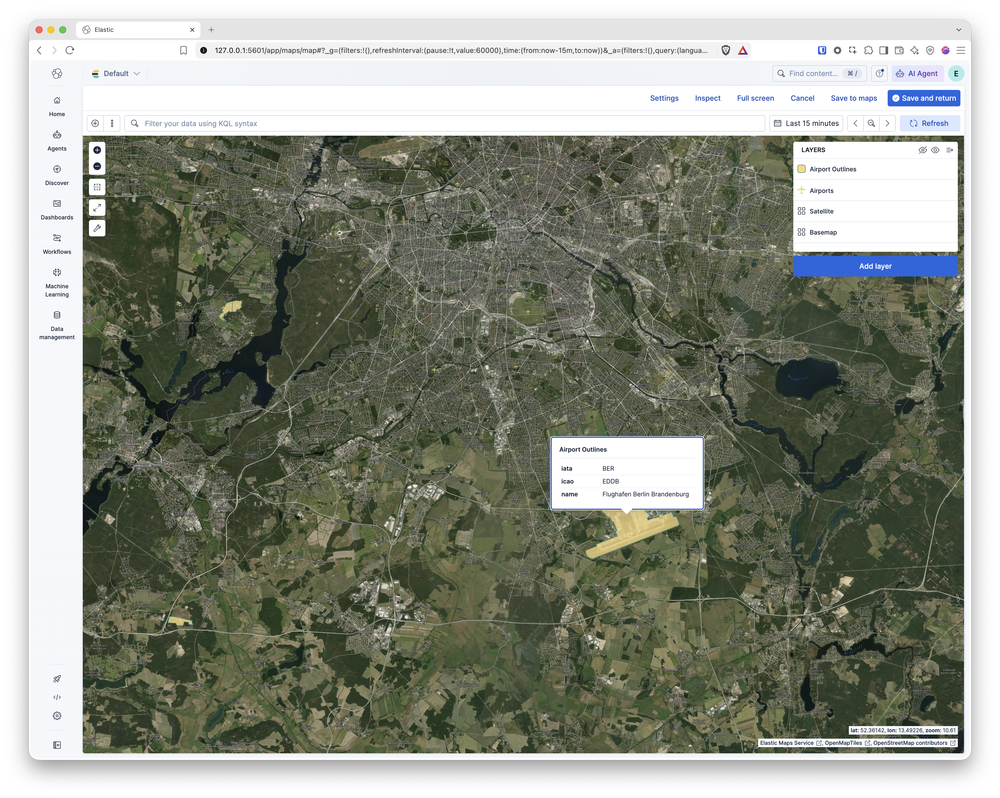

# Elastic Maps Data



This repository contains geospatial datasets in [GeoJSON](https://geojson.org/) format, intended for use with [Elastic Maps](https://www.elastic.co/guide/en/kibana/current/maps.html) / Kibana geo visualizations, or any other tool that consumes GeoJSON.

## Contents

| File | Geometry | Features | Description |
|---|---|---|---|
| [`airports.geojson`](./airports.geojson) | `Point` | 86,067 | Point locations of airports, heliports, seaplane bases, and balloonports worldwide. |
| [`airport-outlines.geojson`](./airport-outlines.geojson) | `MultiPolygon` | 22,821 | Polygon outlines of airport grounds/aerodromes derived from OpenStreetMap. |
| [`airport-outlines-major.geojson`](./airport-outlines-major.geojson) | `MultiPolygon` | 7,479 | Subset of `airport-outlines.geojson` containing only major/notable aerodromes. |

## Schemas

### `airports.geojson`

Point features with the following properties:

| Property | Description |
|---|---|
| `name` | Airport name |
| `type` | Airport category: `large_airport`, `medium_airport`, `small_airport`, `heliport`, `seaplane_base`, `balloonport`, `closed` |
| `iso_country` | ISO 3166-1 alpha-2 country code |
| `iso_region` | ISO 3166-2 region code |
| `municipality` | Nearest city/municipality |
| `elevation_ft` | Elevation in feet |
| `scheduled_service` | Whether the airport has scheduled commercial service (`yes`/`no`) |

### `airport-outlines.geojson` / `airport-outlines-major.geojson`

MultiPolygon features (sourced from OpenStreetMap) with the following properties:

| Property | Description |
|---|---|
| `name` | Airport/aerodrome name |
| `iata` | IATA airport code |
| `icao` | ICAO airport code |
| `aerodrome_type` | Aerodrome classification (e.g. `international`, `military`, `regional`, `private`, `airstrip`, `seaplane`, etc. — free-form OSM tag values) |
| `osm_id` | OpenStreetMap object ID |
| `osm_kind` | OpenStreetMap object type (e.g. `relation`) |
| `area_m2` | Approximate area in square meters |

`airport-outlines-major.geojson` is a filtered subset of `airport-outlines.geojson`, limited to major airports.

## Usage

These files can be loaded directly into Elastic Maps as a layer, indexed into Elasticsearch, or used with any GeoJSON-compatible mapping library (e.g. Leaflet, Mapbox GL, QGIS).

### Import into Elasticsearch with Kibana

1. In Kibana, go to **Maps** and create a new map.
2. Add layer → **Upload GeoJSON** → select the desired file.
3. Follow the prompts to index the data into Elasticsearch and style the layer.

### Import via CLI

```bash
# Example: index a GeoJSON file into Elasticsearch using elasticsearch-loader or a similar tool
elasticsearch_loader --index airports --type _doc geojson airports.geojson
```

### Add satellite imagery as a basemap (MapTiler)

To use satellite imagery as a background layer, you can add the [MapTiler Satellite](https://www.maptiler.com/maps/satellite/) tile service as a **Tile Map Service** in [Elastic Maps](https://www.elastic.co/docs/explore-analyze/visualize/maps/tile-layer):

1. Create a free account at [cloud.maptiler.com](https://cloud.maptiler.com/) and generate an API key.
2. In Kibana, open **Maps** → **Add layer** → select **Tile Map Service**.
3. Enter the following URL template (replace with your own API key):

   ```
   https://api.maptiler.com/maps/satellite/{z}/{x}/{y}.jpg?key=<YOUR_API_KEY>
   ```

4. Save the layer — the satellite tiles will now appear as a basemap underneath your own GeoJSON layers (e.g. `airports.geojson`).

> Note: The free MapTiler tier has a limited monthly tile quota. For production or high-traffic deployments, review the appropriate MapTiler plan and check the license terms for satellite imagery.

## Notes

- Coordinates use the standard GeoJSON `[longitude, latitude]` order (WGS84 / EPSG:4326).
- `aerodrome_type` values are sourced as-is from OpenStreetMap tags and are not normalized (some contain combined/inconsistent values, e.g. `international;civil`).
- Large file sizes (up to ~30 MB) — consider using tools that support streaming GeoJSON parsing for large-scale processing.

## License

Data is derived from public sources such as OpenStreetMap (© OpenStreetMap contributors, [ODbL](https://opendatacommons.org/licenses/odbl/)) and other open airport datasets. Verify the specific license terms of the original source before redistribution.
